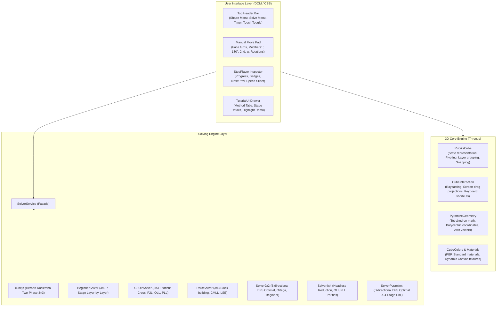

# 🧊 Rubik's 3D Studio & Multi-Method Solver — Architecture & Project Guide

## 1. Project Overview

**Rubik's 3D Studio** is an interactive, high-performance 3D puzzle simulator, speedcubing education platform, and multi-method solver. It provides physics-based 3D graphics, FreeCAD-style viewport navigation, automated step-by-step solving across multiple algorithms, and an interactive curriculum with 3D piece-highlighting.

### Supported Platforms:
- 🌐 **Modern Web Application**: Single-page application built with [Vite](https://vitejs.dev/) and [Three.js](https://threejs.org/).
- 🪟 **Native Windows Desktop**: Packaged via [Electron](https://www.electronjs.org/) (`release/RubiksCubeStudio-win32-x64/RubiksCubeStudio.exe`).
- 🐧 **Linux Desktop**: Standalone binary package (`release/RubiksCubeStudio-linux-x64`).
- 📱 **Native Android Application**: Android Studio project built using [Capacitor 8](https://capacitorjs.com/) (`android/`).

---

## 2. System Architecture



---

## 3. Directory & File Structure

```text
rubic/
├── .github/
│   └── workflows/
│       └── build.yml               # GitHub Actions CI matrix for Linux & Windows packages
├── android/                        # Capacitor Android native project (Gradle / Kotlin)
├── docs/                           # Documentation assets, screenshots
│   ├── screenshot.png
│   ├── screenshot-cube-menu.png
│   ├── screenshot-learn.png
│   ├── screenshot-2x2-solve.png
│   ├── screenshot-2x2-learn.png
│   ├── screenshot-4x4-solve.png
│   └── screenshot-4x4-learn.png
├── electron/
│   └── main.cjs                    # Electron main process (BrowserWindow, dev/prod loading)
├── release/                        # Packaged desktop executables (git-ignored output)
├── scripts/
│   └── screenshot.cjs              # Automated headless screenshot generator via Electron
├── src/
│   ├── cube/
│   │   ├── CubeColors.js           # Palette constants, PBR materials, Canvas center badges
│   │   ├── CubeInteraction.js      # Raycasting, pointer drag-to-turn, touch mode, keybinds
│   │   ├── PyraminxGeometry.js     # Regular tetrahedron geometry, sticker insets, axis math
│   │   └── RubiksCube.js           # 3D scene management, cubie groups, pivot twists, snapping
│   ├── solver/
│   │   ├── BeginnerSolver.js       # 7-stage Layer-by-Layer solver
│   │   ├── CFOPSolver.js           # Fridrich solver (Cross, F2L, OLL, PLL)
│   │   ├── perms4x4.js             # 4×4 permutation cycle constants
│   │   ├── RouxSolver.js           # Roux block-building solver (FB, SB, CMLL, LSE)
│   │   ├── Solver2x2.js            # 2×2 Bidirectional BFS (Optimal), Ortega, Beginner
│   │   ├── Solver4x4.js            # 4×4 Reduction solver & Parity handlers
│   │   ├── SolverPyraminx.js       # Pyraminx BFS Optimal & 4-stage pedagogical solver
│   │   ├── SolverService.js        # Unified solver facade routing solve requests
│   │   ├── TutorialData.js         # Curricula, setup scrambles, mnemonics, highlight filters
│   │   └── VirtualCube4x4.js       # Headless state machine for 4×4 simulation
│   ├── ui/
│   │   ├── ControlsUI.js           # Header, puzzle selector, method dropdown, manual move pad
│   │   ├── StepPlayer.js           # Turn-by-turn playback inspector with speed slider
│   │   └── TutorialUI.js           # Drawer modal for learning curricula and demonstration
│   ├── main.js                     # Application entry point, Three.js renderer, animation loop
│   └── style.css                   # Glassmorphism dark-mode responsive styling
├── capacitor.config.json           # Capacitor configuration for Android app
├── index.html                      # Main HTML page, viewport, menus, modals
├── Launch-RubiksCubeStudio.bat     # Windows desktop shortcut launcher
├── Launch-RubiksCubeStudio.sh      # Linux desktop shortcut launcher
├── package.json                    # Project metadata, dependencies, build scripts
└── vite.config.js                  # Vite configuration (relative base, port 5173)
```

---

## 4. Core Subsystems

### 4.1 3D Geometry & Physics Simulation
- **[`RubiksCube.js`](file:///c:/Users/wei.du/WorkAtTPVision/test/rubic/src/cube/RubiksCube.js)**:
  - Dynamically builds cubies based on puzzle type (`dimension = 2, 3, 4` or `puzzleType = 'pyraminx'`).
  - Implements temporary `THREE.Group` pivots for animating face slices, inner slices (`2R`, `2U`), wide turns (`Rw`, `Uw`), or whole-cube rotations (`x`, `y`, `z`).
  - Snaps cubie positions and quaternions to clean mathematical grid orientations upon completing animations.
  - Extracts current sticker configuration into standardized facelet strings (54 chars for 3×3, 24 for 2×2, 96 for 4×4, 36 for Pyraminx).
- **[`PyraminxGeometry.js`](file:///c:/Users/wei.du/WorkAtTPVision/test/rubic/src/cube/PyraminxGeometry.js)**:
  - Models a regular tetrahedron centered at the origin ($a = 3.2$, $R_c = \sqrt{3/8}a$).
  - 14 physical pieces (4 tips, 4 centers, 6 edges) with 36 external triangular stickers.
  - Computes outward face normals and vertex rotation axes ($U, L, R, B$).

### 4.2 Interaction & Gesture Engine
- **[`CubeInteraction.js`](file:///c:/Users/wei.du/WorkAtTPVision/test/rubic/src/cube/CubeInteraction.js)**:
  - **FreeCAD / CAD-Style Orbit**: Left-click drags turn puzzle slices; right-click drags rotate the 3D camera.
  - **Screen-Space Tangent Projection**: Projects 3D rotational velocity vectors onto the 2D viewport plane to match drag direction to the exact face twist.
  - **Mobile Touch Mode**: Header toggle switches between **✋ Twist** (1-finger face turns) and **🔄 Orbit** (swiping anywhere inspects camera angles without grabbing layers).
  - **Keyboard Bindings**: Face turns (`U, D, L, R, F, B`), modifiers (Shift for Prime, `2` for inner slice, `W` for wide turns, Alt for Pyraminx tips).

### 4.3 Solving Engines
- **[`SolverService.js`](file:///c:/Users/wei.du/WorkAtTPVision/test/rubic/src/solver/SolverService.js)**: Acts as the primary facade.
  - **3×3 Optimal**: Powered by Herbert Kociemba's Two-Phase algorithm via `cubejs` (~20 moves).
  - **3×3 Beginner**: 7-stage Layer-by-Layer solver (Cross, Corners, Second Layer, Yellow Cross, Yellow Edge Permutation, Corner Permutation, Corner Orientation).
  - **3×3 CFOP**: Cross $\to$ 4 F2L pairs $\to$ OLL $\to$ PLL (~70–75 moves).
  - **3×3 Roux**: First Block $\to$ Second Block $\to$ CMLL $\to$ LSE (M/U slice solving).
  - **2×2 Pocket Cube**: Bidirectional BFS finding God's Algorithm ($\le 11$ moves in $<10\text{ms}$), Ortega method, and Beginner LBL.
  - **4×4 Revenge**: Reduction method (Centers $\to$ 12 Dedges $\to$ 3×3 Phase $\to$ OLL/PLL parities).
  - **Pyraminx**: Bidirectional BFS finding shortest core path with trivial tip alignment, and a 4-stage pedagogical beginner method.

### 4.4 UI & Inspection Panel
- **[`StepPlayer.js`](file:///c:/Users/wei.du/WorkAtTPVision/test/rubic/src/ui/StepPlayer.js)**: CAD-style left-docked inspector panel. Provides step badges, natural-language instructions, progress bar, stage indicator pills, start/prev/play/next navigation, and a speed multiplier slider ($0.25\times$ to $3.0\times$).
- **[`TutorialUI.js`](file:///c:/Users/wei.du/WorkAtTPVision/test/rubic/src/ui/TutorialUI.js)**: Curriculum drawer offering interactive guides. The "Load & Demonstrate on 3D Cube" button sets up textbook positions, highlights target pieces, and loads moves into the Step Player.

---

## 5. Development & Build Commands

| Command | Description |
|---|---|
| `npm run dev` | Start Vite local development server on `http://localhost:5173` |
| `npm run build` | Compile and bundle production assets into `dist/` |
| `npm run preview` | Locally preview the production build in `dist/` |
| `npm run electron:dev` | Launch desktop app in Electron pointing to Vite dev server |
| `npm run electron:build:win` | Package standalone Windows 64-bit application into `release/` |
| `npm run electron:build:linux` | Package standalone Linux x64 binary into `release/` |
| `npm run electron:build:all` | Build both Windows and Linux binaries simultaneously |
| `npm run android:sync` | Build web assets and sync into the Capacitor `android/` project |
| `npm run android:open` | Open the native project in Android Studio |
| `npm run android:build` | Build debug APK via Gradle (`gradlew.bat assembleDebug`) |

---

## 6. Coding & Architectural Conventions

- **Vanilla ES Modules**: Native browser ES modules (`import`/`export`) without heavy framework overhead to maximize WebGL rendering performance.
- **Three.js Units & Orientations**:
  - Cube standard orientation: White on Top ($+Y$), Yellow on Bottom ($-Y$), Green on Front ($+Z$), Blue on Back ($-Z$), Red on Right ($+X$), Orange on Left ($-X$).
  - Cubie spacing: $1.0$ unit coordinate step for 3×3; $0.5$ step for 2×2 and 4×4.
- **Move Inversion Consistency**: Every move generated by a solver must supply its strict inverse so `StepPlayer` can step backward seamlessly (`stepBack()`) and restore starting states.
- **Responsive Viewport Offsets**: The 3D viewport canvas transitions smoothly using CSS variables (`body.has-player-dock`, `body.has-tutorial-drawer`) so UI panels never occlude the cube.
