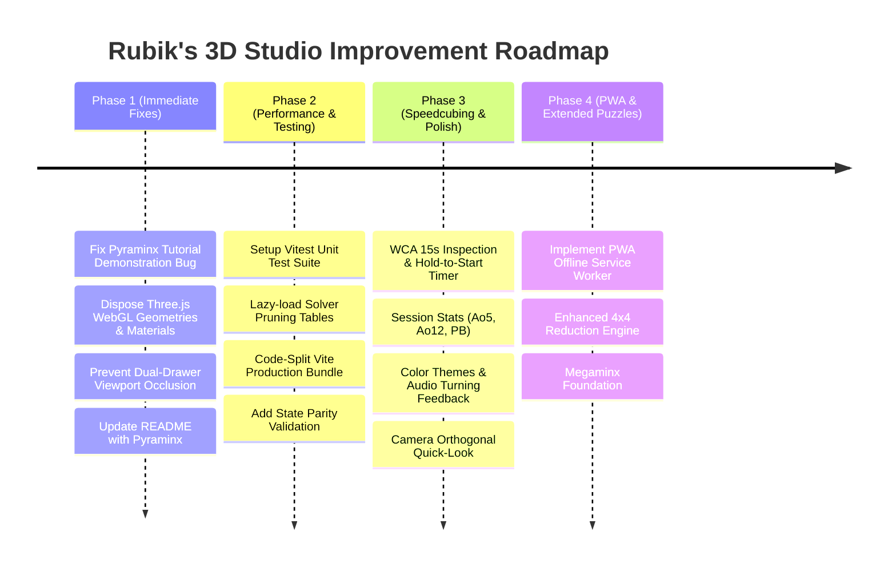

# 📋 Rubik's 3D Studio — Comprehensive Audit, Observations & Improvement Plan

This document details findings from a full-codebase architectural audit of **Rubik's 3D Studio**, covering 3D simulation, solving engines, UI/UX, multi-platform targets, and engineering practices. It provides a prioritized, actionable improvement plan for future development.

---

## 1. Executive Summary

| Category | Status | Summary Findings |
|---|:---:|---|
| **Core 3D Engine & Controls** | 🟢 Solid | High-performance Three.js rendering, clean FreeCAD-style orbit vs. twist separation, responsive touch support, and haptics. |
| **Solving Algorithms** | 🟡 Good / Optimizable | Rich solver collection (Kociemba, CFOP, Roux, 2×2 BFS/Ortega, 4×4 Reduction, Pyraminx). However, synchronous table generation slows startup, and 4×4 deep scramble reduction relies on move history. |
| **User Experience & UI** | 🟢 Good | Clean left-docked inspector and curriculum drawer; needs minor fixes for dual-drawer viewport squeezing and timer feature expansion. |
| **Memory & Performance** | 🟡 Needs Attention | WebGL geometries/materials/textures are not systematically disposed of on puzzle resets; bundle size exceeds 630 kB without code-splitting. |
| **Testing & CI/CD** | 🔴 Critical Gap | Zero automated unit tests exist. CI builds desktop binaries but does not run automated tests or Android verification. |

---

## 2. Detailed Observations & Findings

### 🔴 Category A: Critical & Functional Issues

#### 1. Pyraminx Tutorial Demonstration Bug
- **Location**: [`src/ui/TutorialUI.js`](file:///c:/Users/wei.du/WorkAtTPVision/test/rubic/src/ui/TutorialUI.js#L175-L183)
- **Problem**: When demonstrating stages for the Pyraminx Beginner method (`currentMethod.cubeType === 'pyraminx'`), `demonstrateStage()` calculates target dimension via:
  ```javascript
  const targetDim = currentMethod.cubeType === '2x2' ? 2 : (currentMethod.cubeType === '4x4' ? 4 : 3);
  ```
  This defaults `targetDim` to `3`. Clicking "Load & Demonstrate on 3D Cube" erroneously resets the puzzle to a 3×3 cube instead of Pyraminx.
- **Recommended Fix**: Add explicit handling for non-cubic puzzle shapes:
  ```javascript
  if (currentMethod.cubeType === 'pyraminx') {
    if (this.cube.puzzleType !== 'pyraminx') {
      this.onPuzzleChange ? this.onPuzzleChange('pyraminx') : this.cube.setPuzzleType('pyraminx');
    }
  } else {
    const targetDim = currentMethod.cubeType === '2x2' ? 2 : (currentMethod.cubeType === '4x4' ? 4 : 3);
    if (this.cube.puzzleType !== 'cube' || this.cube.dimension !== targetDim) {
      this.onPuzzleChange ? this.onPuzzleChange('cube', targetDim) : this.cube.setPuzzleType('cube', targetDim);
    }
  }
  ```

#### 2. Dual Panel Viewport Occlusion
- **Location**: [`src/style.css`](file:///c:/Users/wei.du/WorkAtTPVision/test/rubic/src/style.css#L45-L55) & [`src/ui/ControlsUI.js`](file:///c:/Users/wei.du/WorkAtTPVision/test/rubic/src/ui/ControlsUI.js)
- **Problem**: When the StepPlayer inspector is active (`body.has-player-dock` offsets left by 340px) and the user opens the Tutorial Drawer (`body.has-tutorial-drawer` offsets right by up to 620px), the 3D viewport is squeezed into a narrow vertical slit (~100–160px wide).
- **Recommended Fix**: Make the two panels mutually exclusive or auto-minimize the StepPlayer when the tutorial drawer opens, and vice-versa.

#### 3. Documentation Desynchronization
- **Location**: [`README.md`](file:///c:/Users/wei.du/WorkAtTPVision/test/rubic/README.md)
- **Problem**: The README describes 4×4, 3×3, and 2×2 solving methods, but completely omits the implemented **Pyraminx** puzzle, its bidirectional BFS solver, and its 4-stage beginner curriculum.

---

### ⚡ Category B: Memory & Performance

#### 4. WebGL GPU Memory Leaks on Puzzle Switch / Reset
- **Location**: [`src/cube/RubiksCube.js`](file:///c:/Users/wei.du/WorkAtTPVision/test/rubic/src/cube/RubiksCube.js#L74-L97)
- **Problem**: In Three.js, calling `parent.remove(child)` removes nodes from the scene graph but does **not** release GPU memory. In `buildCube()`:
  - `bodyGeometry` (`BoxGeometry`) and `stickerGeometry` (`PlaneGeometry`) are recreated every call.
  - Dynamically generated `CanvasTexture` instances for center sticker face badges remain allocated on GPU memory.
  - In a long session or frequent puzzle switching, VRAM usage accumulates.
- **Recommended Fix**: Implement a comprehensive `disposeHierarchy()` method:
  ```javascript
  disposeObject(obj) {
    if (!obj) return;
    if (obj.geometry) obj.geometry.dispose();
    if (obj.material) {
      const mats = Array.isArray(obj.material) ? obj.material : [obj.material];
      mats.forEach(mat => {
        if (mat.map) mat.map.dispose();
        mat.dispose();
      });
    }
  }
  ```

#### 5. Synchronous Module-Level Pruning Tables
- **Location**: [`src/solver/RouxSolver.js`](file:///c:/Users/wei.du/WorkAtTPVision/test/rubic/src/solver/RouxSolver.js#L80-L98) & [`src/solver/CFOPSolver.js`](file:///c:/Users/wei.du/WorkAtTPVision/test/rubic/src/solver/CFOPSolver.js#L68-L82)
- **Problem**: Importing these modules immediately executes synchronous BFS generation on the main thread:
  ```text
  Building LSE backward table (depth 8)...
  LSE backward table size: 13955
  ```
  On low-tier mobile devices (Android WebView), this introduces frame drops and delayed First Contentful Paint (FCP).
- **Recommended Fix**:
  - Lazily instantiate lookup tables upon the first call to `solveWithRoux()` or `solveWithCFOP()`.
  - Alternatively, serialize the precomputed table into a compact typed array or JSON file loaded asynchronously.

#### 6. Bundle Code-Splitting
- **Location**: [`vite.config.js`](file:///c:/Users/wei.du/WorkAtTPVision/test/rubic/vite.config.js)
- **Problem**: Production build yields a single monolithic chunk (`dist/assets/index-*.js`, 630 kB minified), triggering Vite's 500 kB chunk warning.
- **Recommended Fix**: Configure manual chunking in `vite.config.js`:
  ```javascript
  build: {
    rollupOptions: {
      output: {
        manualChunks: {
          three: ['three'],
          solvers: ['./src/solver/SolverService.js', 'cubejs'],
        }
      }
    }
  }
  ```

---

### 🧩 Category C: Algorithmic & Solver Robustness

#### 7. 4×4 Scramble Reduction Robustness
- **Location**: [`src/solver/Solver4x4.js`](file:///c:/Users/wei.du/WorkAtTPVision/test/rubic/src/solver/Solver4x4.js#L250-L289)
- **Problem**: For deep 4×4 scrambles, the depth-2 reduction search (`findReductionMoves`) cannot find a path to a 3×3 reduced state. It falls back to inverting `options.moveHistory`. If a user manually scrambled the cube without move history, it falls back to a demonstration sequence.
- **Recommendation**:
  - Implement heuristic center-building and dedge-pairing routines (e.g. standard Reduction/Yao steps) to guarantee a reduction solution from any scrambled state.
  - Or clearly indicate in the UI when move history is being inverted vs. a fresh state reduction.

#### 8. Input State Sanity / Solvability Validation
- **Problem**: If an unsolvable state is passed (e.g. single flipped edge on 3×3, single swapped corner on 2×2), solvers can throw errors or loop extensively.
- **Recommendation**: Add a fast parity check in [`SolverService.js`](file:///c:/Users/wei.du/WorkAtTPVision/test/rubic/src/solver/SolverService.js) to validate corner orientation sum ($\sum \equiv 0 \pmod 3$), edge orientation sum ($\sum \equiv 0 \pmod 2$), and permutation sign parity before executing long searches.

---

### 🎨 Category D: UI/UX & Speedcubing Enhancements

#### 9. Speedcubing Timer Features
- **Current State**: Basic click-to-start / click-to-stop timer showing elapsed time.
- **Recommended Enhancements**:
  - **WCA 15-Second Inspection**: Optional countdown with audio/visual warning at 8s and 12s.
  - **Spacebar / Touch Hold-to-Start**: Press and hold Spacebar (or 2 fingers on mobile) until green to begin (Stackmat timer emulation).
  - **Session Statistics**: Track solve history, personal best (PB), Average of 5 (Ao5), and Average of 12 (Ao12).
  - **Scramble Text Banner**: Display current scramble notation above the timer.

#### 10. Cube Customization & Visual Polish
- **Color Palettes**: Allow selecting between:
  - *Standard Classic* (Current).
  - *Stickerless / Half-Bright* (Vibrant fluoro colors).
  - *Pastel / Low-Contrast* (Soft aesthetic tones).
  - *Carbon Fiber / Dark Edition*.
- **Core Plastics**: Option to toggle black plastic, white plastic, or primary plastic body.
- **Lighting Presets**: Studio (default), Sunset/Warm, Neon Cyberpunk, Minimalist Flat.

#### 11. Audio & Camera Navigation
- **Sound Effects**: Subtle mechanical clicking / plastic turning sound upon layer rotation completion (with mute toggle).
- **Camera Quick-Snap**: Hotkeys / buttons to snap camera view directly to Front, Back, Top, Bottom, Left, or Right.

---

### 🛠️ Category E: Quality, Testing & DevOps

#### 12. Automated Testing Suite (Vitest)
- **Status**: There are currently **no automated tests** in the repository.
- **Plan**: Introduce [Vitest](https://vitest.dev/) to test:
  1. Move cancellation functions (`cancelMoves`, `cancelMoves4x4`).
  2. Notation parsing and move inversion (`getInverseMove`, `getMoveParams`).
  3. Solver correctness against benchmark scrambles (3×3 Kociemba, Beginner, CFOP, Roux; 2×2 BFS/Ortega; Pyraminx BFS).
  4. Facelet extraction accuracy from 3D models.

#### 13. Progressive Web App (PWA) Offline Support
- **Status**: Described as PWA-ready, but missing `manifest.webmanifest` and service worker caching.
- **Plan**: Install `vite-plugin-pwa` to enable full offline installability on Android, iOS, Windows, and macOS directly from the browser.

#### 14. CI/CD Workflow Hardening
- **Location**: [`.github/workflows/build.yml`](file:///c:/Users/wei.du/WorkAtTPVision/test/rubic/.github/workflows/build.yml)
- **Plan**:
  - Add a test step (`npm test`) before packaging binaries.
  - Add a lint step (`npm run lint`).
  - Add Android build verification (`gradlew assembleDebug`) to CI.

---

## 3. Prioritized Implementation Roadmap



### Phase 1: Immediate Bugfixes & Memory Hardening
1. Patch `demonstrateStage()` in `TutorialUI.js` to correctly support Pyraminx.
2. Implement recursive WebGL resource disposal in `RubiksCube.js` to eliminate GPU memory leaks.
3. Coordinate `StepPlayer` and `TutorialUI` open states to avoid viewport squeezing.
4. Update `README.md` with complete documentation for Pyraminx.

### Phase 2: Performance, Code-Splitting & Test Coverage
1. Introduce Vitest with test coverage across all solvers and notation utilities.
2. Move `RouxSolver` and `CFOPSolver` table builds from top-level import to lazy initialization.
3. Configure Rollup manual chunking in `vite.config.js`.
4. Add input parity validation in `SolverService.js`.

### Phase 3: Speedcubing Features & UI Polish
1. Add WCA 15-second inspection countdown and Spacebar hold-to-start timer.
2. Add session statistics (Best, Ao5, Ao12) persisted in `localStorage`.
3. Add sticker color themes (Stickerless, Half-Bright, Carbon Fiber) and audio feedback.
4. Add camera quick-snap buttons for orthogonal face views.

### Phase 4: PWA Offline Support & Extended Puzzles
1. Add `vite-plugin-pwa` with service worker caching for offline mobile/web installability.
2. Expand 4×4 reduction heuristics for unassisted manual scrambles.
3. Prepare extensible architecture for Megaminx (12-sided dodecahedron).

---

## 4. Discussion Topics for Pair-Programming

1. **Bugfix Priority**: Should we immediately patch the Pyraminx tutorial demonstration bug and the Three.js memory cleanup?
2. **Testing Setup**: Would you like to introduce Vitest for automated unit testing of the solving engines?
3. **Timer Enhancements**: Would you like to expand the timer with WCA inspection countdown and Ao5/Ao12 statistics?
4. **Theme / Visual Preferences**: Do you have specific sticker palettes (e.g. Fluorescent, Stickerless Bright) or turning audio effects you would like to prioritize?
