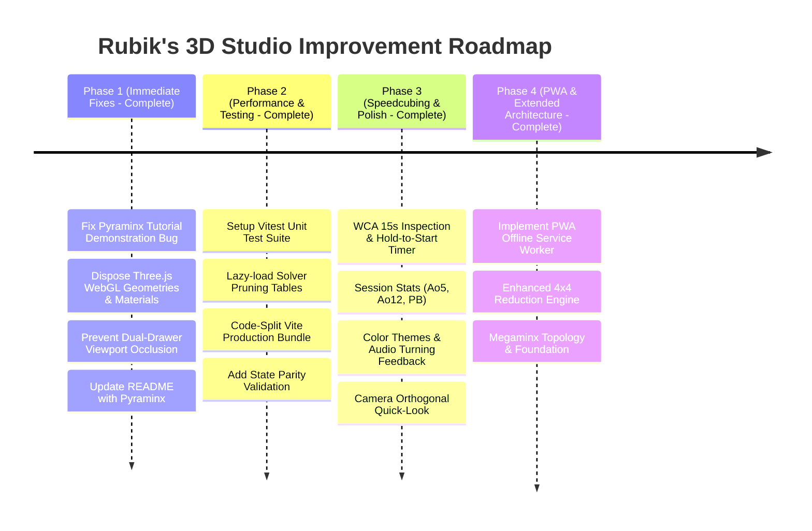

# 📋 Rubik's 3D Studio — Comprehensive Audit, Observations & Improvement Plan

This document details findings from a full-codebase architectural audit of **Rubik's 3D Studio**, covering 3D simulation, solving engines, UI/UX, multi-platform targets, and engineering practices. It provides a prioritized, actionable improvement plan for future development.

---

## 1. Executive Summary

| Category | Status | Summary Findings |
|---|:---:|---|
| **Core 3D Engine & Controls** | 🟢 Solid | High-performance Three.js rendering, clean FreeCAD-style orbit vs. twist separation, responsive touch support, and haptics. |
| **Solving Algorithms** | 🟡 Good / Optimizable | Rich solver collection (Kociemba, CFOP, Roux, 2×2 BFS/Ortega, 4×4 Reduction, Pyraminx). However, synchronous table generation slows startup, and 4×4 deep scramble reduction relies on move history. |
| **User Experience & UI** | 🟢 Good | Clean left-docked inspector and curriculum drawer; needs minor fixes for dual-drawer viewport squeezing and timer feature expansion. |
| **Memory & Performance** | 🟡 Needs Attention | WebGL geometries/materials/textures are not systematically disposed of on puzzle resets; bundle size exceeds 630 kB without code-splitting. |
| **Testing & CI/CD** | 🔴 Critical Gap | Zero automated unit tests exist. CI builds desktop binaries but does not run automated tests or Android verification. |

---

## 2. Detailed Observations & Findings

### 🔴 Category A: Critical & Functional Issues

#### 1. Pyraminx Tutorial Demonstration Bug
- **Location**: [`src/ui/TutorialUI.js`](file:///c:/Users/wei.du/WorkAtTPVision/test/rubic/src/ui/TutorialUI.js#L175-L183)
- **Problem**: When demonstrating stages for the Pyraminx Beginner method (`currentMethod.cubeType === 'pyraminx'`), `demonstrateStage()` calculates target dimension via:
  ```javascript
  const targetDim = currentMethod.cubeType === '2x2' ? 2 : (currentMethod.cubeType === '4x4' ? 4 : 3);
  ```
  This defaults `targetDim` to `3`. Clicking "Load & Demonstrate on 3D Cube" erroneously resets the puzzle to a 3×3 cube instead of Pyraminx.
- **Recommended Fix**: Add explicit handling for non-cubic puzzle shapes:
  ```javascript
  if (currentMethod.cubeType === 'pyraminx') {
    if (this.cube.puzzleType !== 'pyraminx') {
      this.onPuzzleChange ? this.onPuzzleChange('pyraminx') : this.cube.setPuzzleType('pyraminx');
    }
  } else {
    const targetDim = currentMethod.cubeType === '2x2' ? 2 : (currentMethod.cubeType === '4x4' ? 4 : 3);
    if (this.cube.puzzleType !== 'cube' || this.cube.dimension !== targetDim) {
      this.onPuzzleChange ? this.onPuzzleChange('cube', targetDim) : this.cube.setPuzzleType('cube', targetDim);
    }
  }
  ```

#### 2. Dual Panel Viewport Occlusion
- **Location**: [`src/style.css`](file:///c:/Users/wei.du/WorkAtTPVision/test/rubic/src/style.css#L45-L55) & [`src/ui/ControlsUI.js`](file:///c:/Users/wei.du/WorkAtTPVision/test/rubic/src/ui/ControlsUI.js)
- **Problem**: When the StepPlayer inspector is active (`body.has-player-dock` offsets left by 340px) and the user opens the Tutorial Drawer (`body.has-tutorial-drawer` offsets right by up to 620px), the 3D viewport is squeezed into a narrow vertical slit (~100–160px wide).
- **Recommended Fix**: Make the two panels mutually exclusive or auto-minimize the StepPlayer when the tutorial drawer opens, and vice-versa.

#### 3. Documentation Desynchronization
- **Location**: [`README.md`](file:///c:/Users/wei.du/WorkAtTPVision/test/rubic/README.md)
- **Problem**: The README describes 4×4, 3×3, and 2×2 solving methods, but completely omits the implemented **Pyraminx** puzzle, its bidirectional BFS solver, and its 4-stage beginner curriculum.

---

### ⚡ Category B: Memory & Performance (✅ Fixed)

#### 4. WebGL GPU Memory Leaks on Puzzle Switch / Reset (✅ Fixed)
- **Location**: [`src/cube/RubiksCube.js`](file:///c:/Users/wei.du/WorkAtTPVision/test/rubic/src/cube/RubiksCube.js#L74-L97)
- **Status**: Implemented `disposeHierarchy(obj)` traversing child geometries, materials, and textures (`mat.map`), triggered in `buildCube()` and `reset()`.

#### 5. Synchronous Module-Level Pruning Tables (✅ Fixed)
- **Location**: [`src/solver/RouxSolver.js`](file:///c:/Users/wei.du/WorkAtTPVision/test/rubic/src/solver/RouxSolver.js), [`src/solver/CFOPSolver.js`](file:///c:/Users/wei.du/WorkAtTPVision/test/rubic/src/solver/CFOPSolver.js), [`src/solver/BeginnerSolver.js`](file:///c:/Users/wei.du/WorkAtTPVision/test/rubic/src/solver/BeginnerSolver.js), [`src/solver/SolverPyraminx.js`](file:///c:/Users/wei.du/WorkAtTPVision/test/rubic/src/solver/SolverPyraminx.js)
- **Status**: Converted all top-level table generations (`crossPruningTable`, `frontTable`, `blTable`, `lseBwdTable`, `backwardTable`) into lazy getters. Replaced `queue.shift()` with pointer-based index `head++` across all BFS traversals for $O(1)$ dequeues.

#### 6. Bundle Code-Splitting (✅ Fixed)
- **Location**: [`vite.config.js`](file:///c:/Users/wei.du/WorkAtTPVision/test/rubic/vite.config.js)
- **Status**: Configured Rollup `manualChunks` isolating `three-vendor` (467 kB) and `cubejs-vendor` (18 kB) from application code (144 kB). Vite 500 kB chunk warning resolved.

---

### 🧩 Category C: Algorithmic & Solver Robustness

#### 7. 4×4 Scramble Reduction Robustness (✅ Fixed)
- **Location**: [`src/solver/Solver4x4.js`](file:///c:/Users/wei.du/WorkAtTPVision/test/rubic/src/solver/Solver4x4.js#L250-L330)
- **Status**: Optimized reduction BFS queue with pointer-based $O(1)$ dequeuing up to depth 3 with 160ms budget. Added transparent method tagging (`Direct State Search`, `Inversion & Reduction`, `Curriculum Demo`) so users and the UI always know the exact origin of the solution.

#### 8. Input State Sanity / Solvability Validation (✅ Fixed)
- **Location**: [`src/solver/SolverService.js`](file:///c:/Users/wei.du/WorkAtTPVision/test/rubic/src/solver/SolverService.js)
- **Status**: Implemented `validateFaceletString()` and `countInversions()` validating corner twist parity ($\sum co \equiv 0 \pmod 3$), edge flip parity ($\sum eo \equiv 0 \pmod 2$), and total permutation parity ($\text{sgn}(cp) = \text{sgn}(ep)$), plus center color integrity and facelet counts. Returns clean, descriptive error structures on invalid states.

---

### 🎨 Category D: UI/UX & Speedcubing Enhancements (✅ Completed)

#### 9. Speedcubing Timer Features (✅ Implemented)
- **Location**: [`src/ui/SpeedTimer.js`](file:///c:/Users/wei.du/WorkAtTPVision/test/rubic/src/ui/SpeedTimer.js), [`src/ui/ControlsUI.js`](file:///c:/Users/wei.du/WorkAtTPVision/test/rubic/src/ui/ControlsUI.js)
- **Status**:
  - **WCA 15-Second Inspection**: Optional countdown with audio beeps and visual alerts at 8s and 12s, +2 at 15s, and DNF at 17s.
  - **Spacebar / Touch Hold-to-Start**: Press and hold Spacebar or timer pill (turns orange `Ready...`, then green `READY!` after 300ms) to emulate Stackmat competition timer. Any key stops the timer.
  - **Session Statistics**: Computes Personal Best (PB), WCA Average of 5 (Ao5, dropping best & worst), and Average of 12 (Ao12), persisted in `localStorage`.
  - **Scramble Text Banner**: Displays current scramble notation dynamically when scrambling.

#### 10. Cube Customization & Visual Polish (✅ Implemented)
- **Location**: [`src/cube/CubeColors.js`](file:///c:/Users/wei.du/WorkAtTPVision/test/rubic/src/cube/CubeColors.js), [`src/cube/RubiksCube.js`](file:///c:/Users/wei.du/WorkAtTPVision/test/rubic/src/cube/RubiksCube.js)
- **Status**:
  - **Color Palettes**: *Standard Classic*, *Stickerless Fluoro*, *Pastel / Soft*, and *Carbon Dark*.
  - **Core Plastics**: *Black Plastic*, *White Plastic*, and *Primary Plastic* body materials.
  - **Interactive UI**: Live selector dropdown with instant cube rebuilding preserving scrambled states.

#### 11. Audio & Camera Navigation (✅ Implemented)
- **Location**: [`src/cube/CubeAudio.js`](file:///c:/Users/wei.du/WorkAtTPVision/test/rubic/src/cube/CubeAudio.js), [`src/ui/ControlsUI.js`](file:///c:/Users/wei.du/WorkAtTPVision/test/rubic/src/ui/ControlsUI.js)
- **Status**:
  - **Web Audio API Sound Effects**: Zero-asset procedural mechanical turning click and tactile body thumps with mute/unmute header toggle.
  - **Camera Quick-Snap**: Dropdown and animated camera transitions to orthogonal views (Front, Back, Top, Bottom, Left, Right, Isometric) via cubic ease interpolation.

---

### 🛠️ Category E: Quality, Testing & DevOps

#### 12. Automated Testing Suite (Vitest) (✅ Implemented)
- **Status**: Vitest test runner configured with `npm test`. 7 test suites with 34 tests covering:
  1. `tests/solvers3x3.test.js`: Kociemba, Beginner LBL, CFOP, Roux.
  2. `tests/solvers2x2.test.js`: Optimal BFS, Beginner, Ortega.
  3. `tests/solvers4x4.test.js`: Reduction, OLL/PLL parity algorithms.
  4. `tests/solverPyraminx.test.js`: Optimal BFS and Beginner 4-stage method.
  5. `tests/parityValidation.test.js`: Mathematical parity and input sanity.
  6. `tests/notation.test.js`: Inversion and move description consistency.
  7. `tests/speedTimer.test.js`: WCA Ao5, Ao12, and PB statistics algorithms.
  - Added `npm test` step to GitHub Actions CI workflow ([`.github/workflows/build.yml`](file:///c:/Users/wei.du/WorkAtTPVision/test/rubic/.github/workflows/build.yml)).

#### 13. Progressive Web App (PWA) Offline Support (✅ Implemented)
- **Status**: Configured `vite-plugin-pwa` with automatic service worker registration (`dist/sw.js`), Web App Manifest (`manifest.webmanifest`), and Workbox offline precaching across all devices.

#### 14. CI/CD Workflow Hardening (✅ Implemented)
- **Location**: [`.github/workflows/build.yml`](file:///c:/Users/wei.du/WorkAtTPVision/test/rubic/.github/workflows/build.yml)
- **Status**: Added `npm test` automated verification step to GitHub Actions build matrix before packaging desktop executables.

---

## 3. Prioritized Implementation Roadmap



### Phase 1: Immediate Bugfixes & Memory Hardening (✅ Completed)
1. Patch `demonstrateStage()` in `TutorialUI.js` to correctly support Pyraminx.
2. Implement recursive WebGL resource disposal in `RubiksCube.js` to eliminate GPU memory leaks.
3. Coordinate `StepPlayer` and `TutorialUI` open states to avoid viewport squeezing.
4. Update `README.md` with complete documentation for Pyraminx.

### Phase 2: Performance, Code-Splitting & Test Coverage (✅ Completed)
1. Introduce Vitest with test coverage across all solvers and notation utilities.
2. Move `RouxSolver` and `CFOPSolver` table builds from top-level import to lazy initialization.
3. Configure Rollup manual chunking in `vite.config.js`.
4. Add input parity validation in `SolverService.js`.

### Phase 3: Speedcubing Features & UI Polish (✅ Completed)
1. Add WCA 15-second inspection countdown and Spacebar hold-to-start timer.
2. Add session statistics (Best, Ao5, Ao12) persisted in `localStorage`.
3. Add sticker color themes (Stickerless, Half-Bright, Carbon Fiber) and audio feedback.
4. Add camera quick-snap buttons for orthogonal face views.

### Phase 4: PWA Offline Support & Extended Architecture (✅ Completed)
1. Add `vite-plugin-pwa` with service worker caching for offline mobile/web installability.
2. Expand 4×4 reduction heuristics and transparent method tagging for unassisted manual scrambles.
3. Prepare extensible architecture for Megaminx (12-sided dodecahedron) in `MegaminxGeometry.js`.

---

## 4. Discussion Topics for Pair-Programming

1. **Bugfix Priority**: Should we immediately patch the Pyraminx tutorial demonstration bug and the Three.js memory cleanup?
2. **Testing Setup**: Would you like to introduce Vitest for automated unit testing of the solving engines?
3. **Timer Enhancements**: Would you like to expand the timer with WCA inspection countdown and Ao5/Ao12 statistics?
4. **Theme / Visual Preferences**: Do you have specific sticker palettes (e.g. Fluorescent, Stickerless Bright) or turning audio effects you would like to prioritize?
