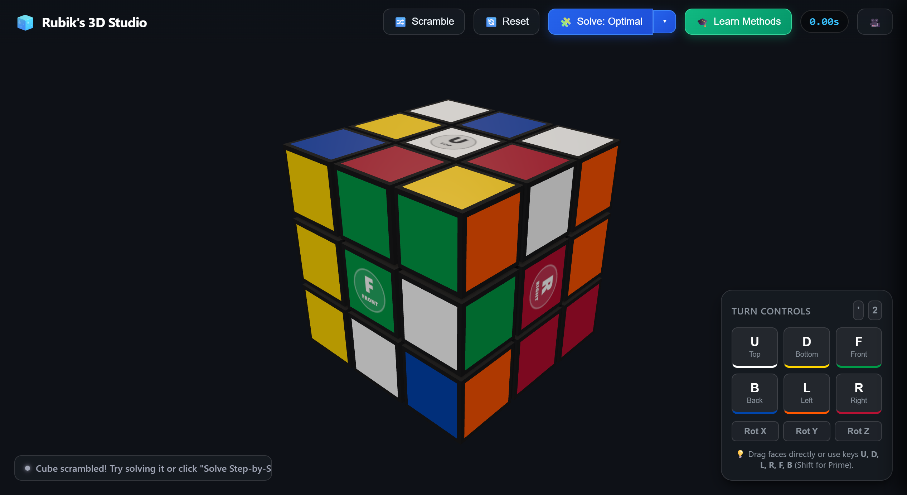

# 🧊 Rubik's 3D Studio & Multi-Method Solver

An interactive, high-performance 3D Rubik's Cube studio and speedcubing learning platform. Features realistic physics-based 3D graphics, FreeCAD-style viewport navigation, automated step-by-step solving across 4 proven methods, and an interactive visual tutorial curriculum with piece-highlighting demonstrations.

Available as both a **Native Windows Desktop Application (.exe)** and a **Modern Web Application**.

---



---

## ✨ Key Features

### 🧩 4 Solving Methods (Optimal & Human)
Select your preferred solving method directly from the top solver dropdown:

| Method | Stages | Typical Moves | Description |
|---|:---:|:---:|---|
| **⚡ Optimal (Kociemba)** | 1 | ~20–22 | Two-phase mathematical group theory solver finding the shortest path to solve. |
| **🔰 Beginner (LBL)** | 7 | ~110–120 | The classic Layer-by-Layer method with intuitive stages and easy-to-learn algorithms. |
| **👑 CFOP (Fridrich)** | 4 | ~70–75 | The world speedcubing standard: Cross → 4 First Two Layer (F2L) slots → OLL → PLL. |
| **💡 Roux Method** | 4 | ~70–75 | Intuitive block-building & M-slice: First Block → Second Block → CMLL → LSE. |

### 🎬 Interactive Step-by-Step Inspector Panel
- **Left-Docked CAD-Style Inspector**: Keeps 100% of the vertical viewport clearance for the 3D cube with zero bottom occlusion.
- **Visual Move Guidance**: Clear move badges (`R'`, `U2`, etc.) accompanied by natural-language instructions ("Turn Right face 90° CCW").
- **Full Playback Navigation**: Play, pause, step forward, step backward, or jump to the starting state.
- **Fine Speed Controls**: Discrete speed multiplier slider (`0.25x`, `0.5x`, `0.75x`, `1.0x`, `1.5x`, `2.0x`, `3.0x`).

### 🎓 Learn Methods ("Load & Demonstrate on 3D Cube")
- Step-by-step curriculum for **Beginner**, **CFOP**, and **Roux**.
- Each stage includes goal explanations, mnemonics, and algorithms.
- **"Load & Demonstrate on 3D Cube"**: Scrambles the cube to the exact textbook scenario, dims unrelated pieces to highlight target pieces, and loads the solution into the step player for turn-by-turn demonstration.
- Highlights automatically restore when you start solving or resetting the cube.

### 🔄 Precision FreeCAD / CAD-Style 3D Controls
Strict separation of mouse actions prevents accidental camera movement while turning faces:

| Action | Mouse / Keyboard | Description |
|---|---|---|
| **Turn Cube Face** | **Left-Click Drag** on piece | Click any outer piece and drag in the desired turn direction (22px responsive threshold). |
| **Orbit 3D Camera** | **Right-Click Drag** anywhere | Smoothly rotates the 3D cube viewpoint from any angle. |
| **Pan Camera** | **Shift + Right-Click** or **Ctrl + Right-Click** | Translates/pans the camera view across the screen. |
| **Zoom / Dolly** | **Scroll Wheel** | Zooms camera in and out smoothly. |
| **Camera Reset** | Click **🎥** in header | Restores default isometric perspective. |

### 🎛️ Manual Move Pad & Keyboard Shortcuts
- **On-Screen Control Pad** (bottom right):
  - Turn buttons: **U** (Top/White), **D** (Bottom/Yellow), **F** (Front/Green), **B** (Back/Blue), **L** (Left/Orange), **R** (Right/Red).
  - Modifier toggles: **`'`** (Prime / Counter-Clockwise) and **`2`** (180° Double Turn).
  - Whole-cube rotations: **Rot X**, **Rot Y**, **Rot Z**.
- **Keyboard Shortcuts**:
  - `U`, `D`, `L`, `R`, `F`, `B` for clockwise face turns.
  - Hold `Shift` + key for prime counter-clockwise turns (e.g., `Shift + R` for `R'`).

---

## 🚀 Running the Application

### 1. Native Windows Desktop App (.exe)

You can launch the desktop application directly:
- **Root Launcher**: Double-click [`Launch-RubiksCubeStudio.bat`](./Launch-RubiksCubeStudio.bat).
- **Or direct executable**: Run `release/RubiksCubeStudio-win32-x64/RubiksCubeStudio.exe`.

#### Building the Executable from Source:
```bash
npm install
npm run electron:build
```
This builds the production Vite bundle and packages the standalone Windows binary with Electron Packager into `release/RubiksCubeStudio-win32-x64`.

---

### 2. Web Browser Application

Run the local Vite development server:
```bash
npm install
npm run dev
```
Open **`http://localhost:5173`** in your browser.

To expose the dev server to other devices on the same Wi-Fi network (e.g. tablet or mobile):
```bash
npm run dev -- --host
```

---

## 🛠️ Tech Stack & Architecture

- **Rendering Engine**: [Three.js](https://threejs.org/) (Custom cubie groups, canvas textures for center badges, PBR materials, soft shadows).
- **Desktop Framework**: [Electron](https://www.electronjs.org/) (Standalone native window, offline-first).
- **Build Tool**: [Vite](https://vitejs.dev/) (Lightning-fast HMR and production Rollup bundling).
- **Solving Engine**:
  - [cubejs](https://github.com/ldez/cubejs) (Herbert Kociemba Two-Phase mathematical solver).
  - Custom algorithmic rule engines for Beginner Layer-by-Layer, CFOP, and Roux.

---

## 📄 License

MIT License. Free for personal, educational, and open-source use.
